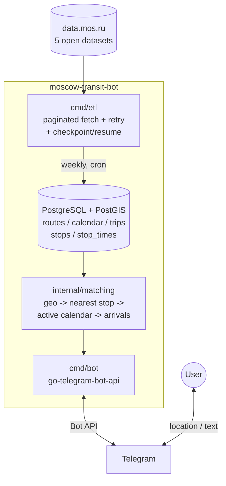

<div align="center">

# 🚌 Moscow Transit Bot

**Telegram bot for real-time-ish Moscow bus arrivals, built on official open transit data**

[](https://go.dev)
[](https://www.postgresql.org)
[](https://postgis.net)
[](https://core.telegram.org/bots)
[](https://www.docker.com)
[](#current-status)

[Overview](#overview) •
[Architecture](#architecture) •
[Tech Stack](#technology-stack) •
[Bot Features](#bot-features) •
[Structure](#project-structure) •
[Status](#current-status) •
[Author](#author)

</div>

---

## Overview

**Moscow Transit Bot** answers one question people ask every day standing at a bus stop: *when does my bus actually arrive?*

It syncs Moscow's official public transit schedule (GTFS-equivalent open data from [data.mos.ru](https://data.mos.ru)) into a PostgreSQL/PostGIS database, then serves live-computed arrival predictions through a Telegram bot — by geolocation, by stop name, or from a saved favorite.

There is no official real-time GTFS-RT feed for Moscow buses, so the bot works from the static published schedule: which trips run today (weekday + calendar validity), and how long until each one reaches a given stop. No live vehicle positions — just an honest, always-correct answer based on the published timetable.

|                          |                        |                          |
| ------------------------ | ----------------------- | ------------------------ |
| 📡 5-Dataset GTFS ETL     | 🗺️ PostGIS Geo-Matching | 🤖 Telegram Bot           |
| ⭐ Favorites & Subscriptions | 🐳 Docker Compose      | ♻️ Checkpointed, Resumable ETL |

---

## Bot Features

* 📍 **Nearest stops by geolocation** — send your live location, get the closest bus stops with upcoming arrivals, sorted by distance
* ⌨️ **Text fallback** — some clients (e.g. Telegram Desktop) don't reliably send live location; typing `55.566, 37.406` works the same way
* 🔎 **Search by stop name** — no location needed, just type part of a stop's name
* ⭐ **Favorite stop** (`/next`) — save one stop, get its arrivals instantly without searching again
* 🔔 **Route subscriptions** (`/subscriptions`) — follow a specific route at a specific stop (e.g. "878 at Летово"), with one-tap unsubscribe
* 🇷🇺 **Correct Russian pluralization** — "через 1 минуту" / "через 3 минуты" / "через 11 минут", not a lazy default

---

## Technology Stack

| Layer               | Technology                                  |
| -------------------- | -------------------------------------------- |
| Language              | Go                                            |
| Database              | PostgreSQL + PostGIS                          |
| Type-safe SQL         | sqlc (generates Go from raw SQL)              |
| DB driver              | pgx/v5 (+ `COPY` for bulk inserts)            |
| Migrations             | golang-migrate                                |
| Telegram integration   | go-telegram-bot-api                           |
| Source data            | [data.mos.ru](https://data.mos.ru) Open Data API (5 GTFS-equivalent datasets) |
| Containers             | Docker / Docker Compose                       |
| Deployment              | Frankfurt VPS (outside Telegram's RU network block) |
| Version Control         | Git                                           |
| IDE                     | VS Code (WSL)                                 |
| OS                      | Ubuntu (WSL2 for dev, Ubuntu 24 for prod)     |

---

## Architecture



**Static-only by design.** Moscow publishes no official GTFS-realtime feed for buses — only the five static datasets that make up the timetable. Rather than reverse-engineer an undocumented live endpoint, the bot computes arrivals purely from the published schedule: today's active `service_id` (weekday + calendar date range) joined against `stop_times`, filtered to "now and later." This is accurate by definition — it's exactly what the transit authority published — even though it can't reflect real-world delays.

**Why PostGIS.** Nearest-stop lookups run as a proper `ORDER BY geom <-> point` k-NN query against a GIST index, not a manual haversine loop in application code — correct and fast even across ~18k stops.

**ETL resilience.** The source API is occasionally unstable (intermittent 5xx errors, timeouts) and the largest dataset (`stop_times`, ~5.3M rows) can take hours to fully paginate. The ETL retries transient failures with backoff, bulk-inserts via a staging table + `COPY` instead of row-by-row `INSERT`, and persists a resumable checkpoint in the database itself — so a crash, a lost SSH session, or a power outage mid-run costs minutes of re-fetching, not the whole run.

---

## Project Structure

```text
moscow-transit-bot/
│
├── cmd/
│   ├── etl/                # fetch, parse, and load all 5 datasets into Postgres
│   └── bot/                # Telegram bot: handlers, inline keyboards, callbacks
│
├── internal/
│   ├── mosru/               # data.mos.ru API client (pagination, retry, parsing)
│   ├── db/                  # sqlc-generated queries + hand-written bulk/checkpoint helpers
│   ├── matching/             # geo / name / favorite / subscription matching pipelines
│   ├── telegram/             # message formatting, coordinate parsing, SOCKS5 proxy client
│   └── config/                # environment-based configuration
│
├── migrations/                # golang-migrate SQL migrations
├── docker-compose.yml          # local dev stack (Postgres only)
├── docker-compose.prod.yml     # production stack (Postgres + bot, etl on demand)
├── Dockerfile                  # multi-stage build: etl and bot targets
├── run-etl.sh                  # cron entrypoint for the weekly ETL run
└── sqlc.yaml
```

---

## Data Pipeline

| Dataset (data.mos.ru) | GTFS equivalent | Rows (current sync) |
| ----------------------- | ----------------- | ---------------------- |
| Остановки (via `/features`) | `stops.txt`        | ~17,800               |
| Маршруты                 | `routes.txt`        | ~930                  |
| Календарь маршрутов        | `calendar.txt`       | ~1,900                |
| Рейсы маршрутов             | `trips.txt`           | ~203,500               |
| Расписание рейсов            | `stop_times.txt`       | ~5,300,000             |

Known, handled data-quality gaps in the source: a small fraction of `trips` reference `route_id`/`service_id` values not present in the corresponding release (skipped, not failed); some stops report `TransportType` as an array instead of a string when served by multiple transport types (parsed flexibly); `stop_times_id` is consistently empty in the source, so rows are keyed by the API's own `global_id` instead.

---

## Current Status

**Currently implemented:**

* ✅ ETL for all 5 datasets, with pagination, retry/backoff, and streaming batch inserts via `COPY`
* ✅ Checkpoint/resume for the large `stop_times` sync — survives session drops and power loss
* ✅ PostGIS-backed nearest-stop matching, with today's active service calendar correctly applied
* ✅ Telegram bot: geolocation, text-coordinate fallback, stop-name search
* ✅ Favorite stop (`/next`) and route subscriptions (`/subscriptions`), both via inline keyboards
* ✅ Correct Russian numeral pluralization for arrival times
* ✅ Deployed on a Frankfurt VPS via Docker Compose — outside the RU network block on `api.telegram.org`, no proxy needed in production
* ✅ Weekly ETL re-sync scheduled via cron

**Next milestones:**

* [ ] Investigate an unofficial live-position source for `transport.mos.ru` (optional — MVP is fully static by design)
* [ ] Proactive "leave now" notifications for subscribed routes, if a live source becomes available
* [ ] Multi-slot favorites (e.g. "home" / "work") instead of a single favorite stop

---

## Author

<table>
  <tr>
    <td align="center">
      <b>Michail Sokun</b>
    </td>
  </tr>
</table>

---

## License

This project is licensed under the terms of the MIT License.
